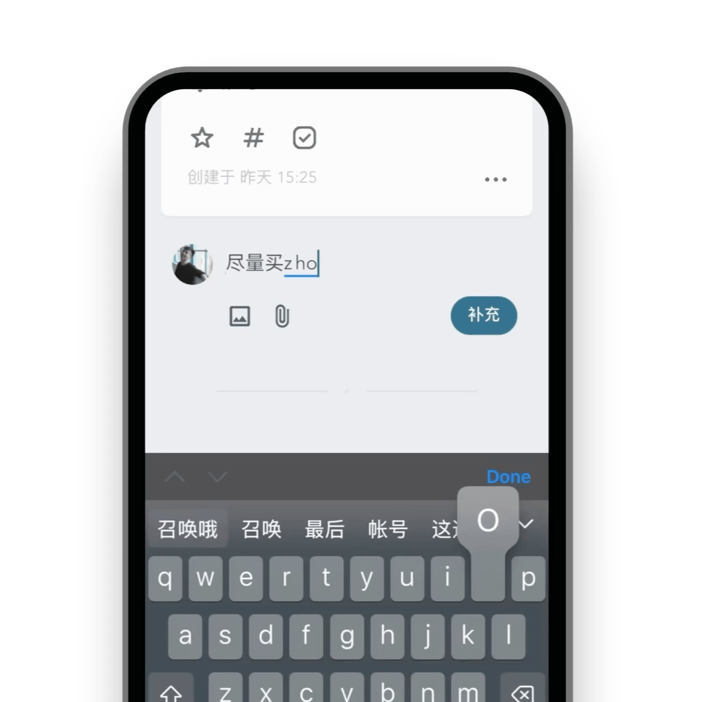

<div align="center">

  

  <h3>Liubai</h3>

  <p>你的笔记 + 日程 + 待办清单 + 任务 with AI</p>

  > *留白记事，放大你的能力*

</div>

<br>

## 已实现 🥂

✅ 原子化附着: 文本、图片、多级标签、状态、文件

✅ 云端同步

✅ 响应式设计: 支持 300px ~ 1920px 宽度的屏幕，从 📱 到 💻

✅ AI 加持: 已连接 Baichuan / DeepSeek / Kimi / MiniMax / Stepfun / Zhipu / 01.ai 等大模型，它们被直接装在你的微信里。

✅ 隐私: 支持原子化管理每张卡片，让你设置 “仅保存本地” 或 “拒绝 AI 读取”；你的数据，你的自由。

✅ 浅色/深色模式

✅ 本地优先: PWA 的 service-worker 让你断网也能使用

✅ 微信集成: 日程提醒，使用微信通知你

✅ i18n 中/英切换

✅ 富文本编辑器，支持轻量 Markdown


## 概览 📂

```
.
├─ liubai-backends
│  └─ liubai-laf
├─ liubai-docs
└─ liubai-frontends
   └─ liubai-web
```

`liubai-web` 为前端根目录，主要基于 [Vue 3.x](https://vuejs.org/) + [Vite](https://vite.dev/) + [VueUse](https://vueuse.org/) + [TypeScript](https://www.typescriptlang.org/) + [Dexie.js](https://dexie.org/docs/) + [TipTap](https://tiptap.dev/) ...... 等一系列前端工具链构建，在该目录下运行 `pnpm i` 和 `pnpm dev` 即可启动留白前端。

`liubai-laf` 为后端根目录，使用 [Laf](https://github.com/labring/laf) 构建；该目录下的 `cloud-functions/` 存放本项目的云函数。

`liubai-docs` 为文档根目录，使用 [VitePress](https://vitepress.dev/) 构建。


## 保持联络 👋

<p>
  <a href="https://github.com/yenche123/liubai/discussions">
    
  </a>
</p>

<p>
  
</p>

<p>
  <a href="https://www.xiaohongshu.com/user/profile/5d1642d80000000011033c24" alt="xhs">
    
  </a>
</p>

## 探索留白 🍭

<div align="center">

  
  <p>添加日程</p>

  
  <p>在微信里同时跟三个助手对话</p>

  
  <p>在卡片下补充说明</p>

  
  <p>离线时依然可用</p>

  
  <p>原子化附着，需要时再展开</p>

  
  <p>自行浏览日程</p>

  
  <p>问 AI 我的日程</p>

  
  <p>在微信里，直接让AI帮你作画</p>

  
  <p>多设备、全平台</p>

  
  <p>看板</p>

</div>

## 开源许可

AGPLv3

