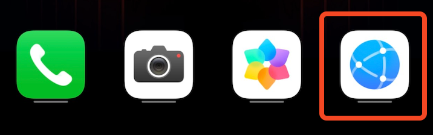
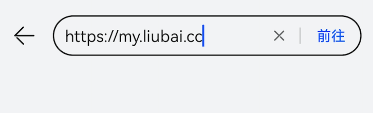
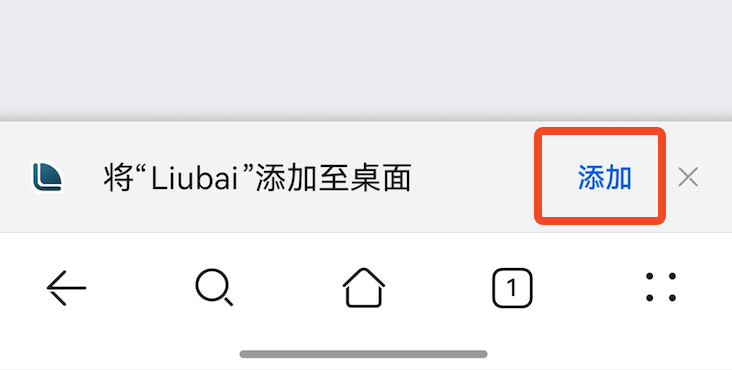
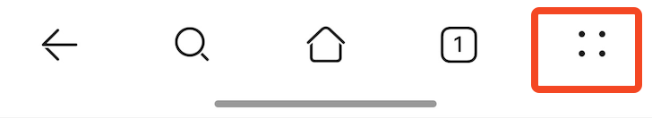
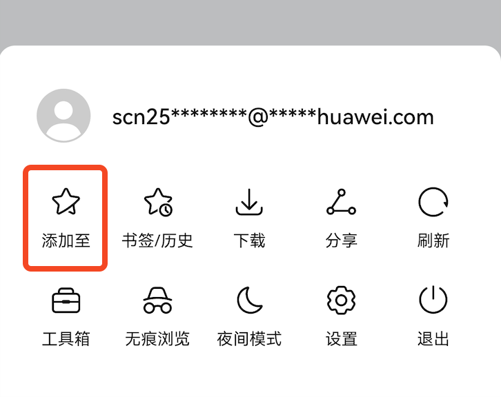
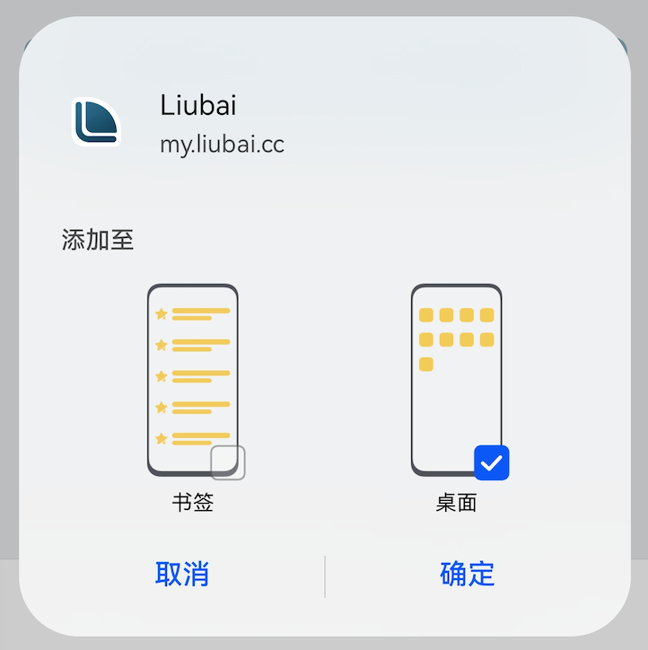
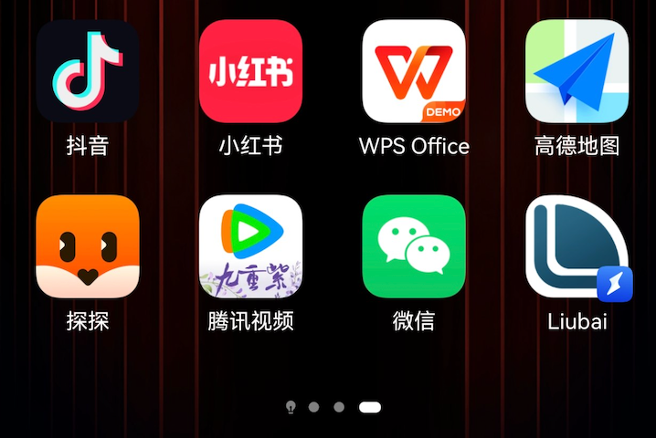

# 在华为上安装

## 1. 复制链接

`https://my.liubai.cc`

<CopyButton />

## 2. 打开浏览器

## 3. 黏贴链接

在地址栏上，黏贴链接。 

并点击`前往`。

## 4. 注意页面底部

打开留白登录页面后

- 如果页面底部有弹出 `添加` 按钮，点击即安装。直接跳到最后一步。

- 如果没有，点击底部工具栏的更多按钮。

## 5. 点击“添加至”

可能会让你选添加至哪里，选择 `桌面` 然后按确定。

## 6. 安装完成

稍等片刻后，回到桌面上，应该就能看到留白记事了。

