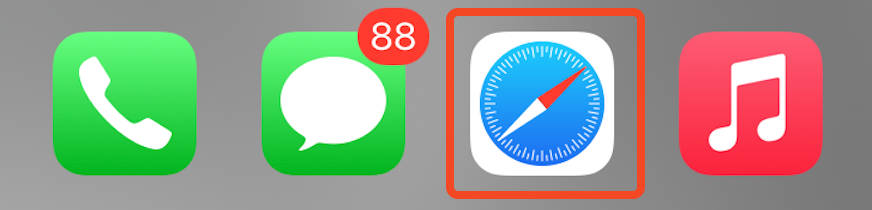
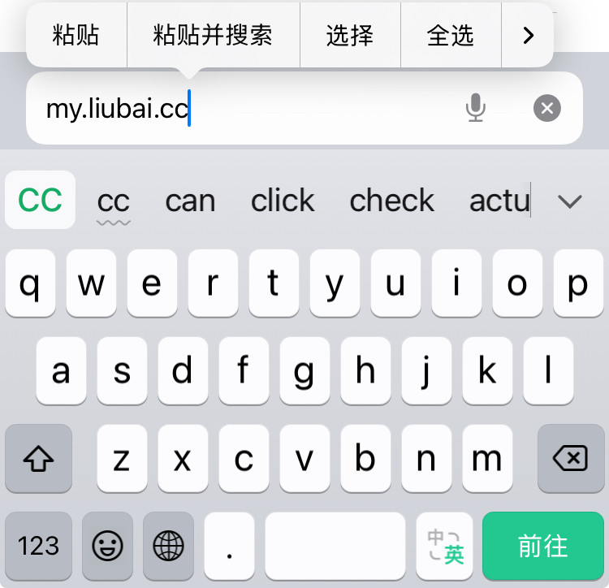
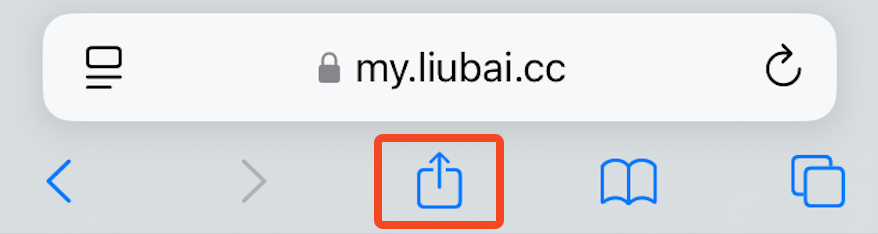
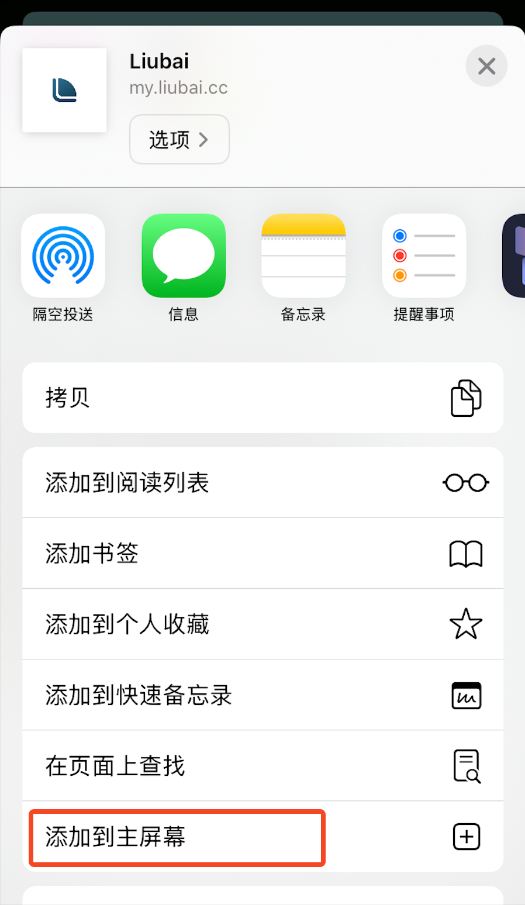
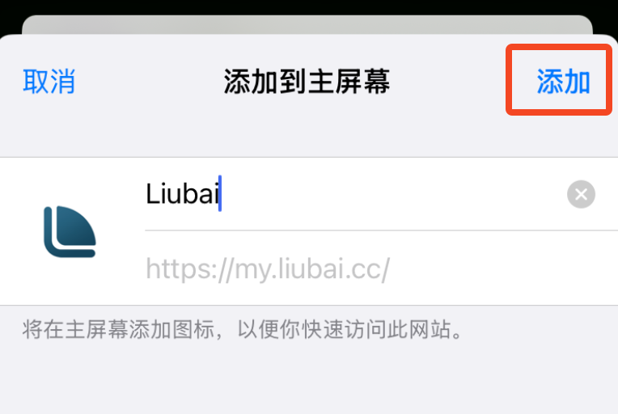
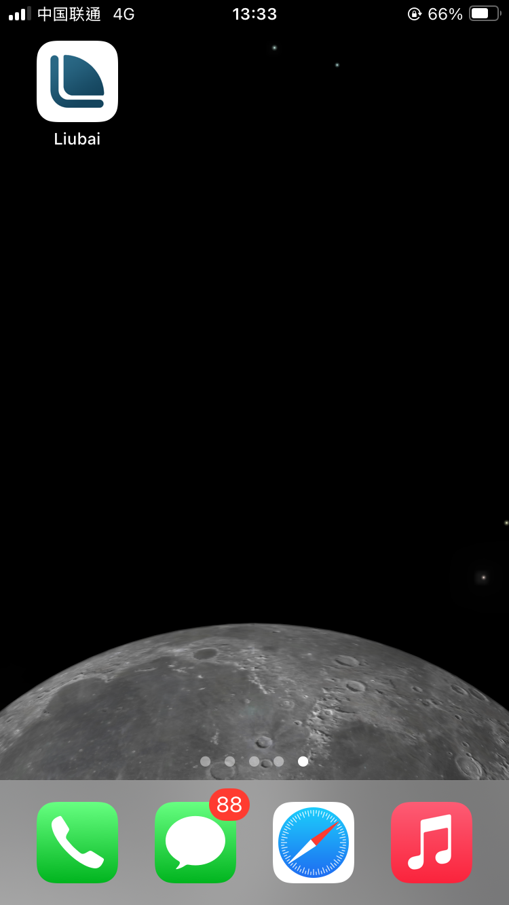

# 在 iPhone 上安装

## 1. 复制链接

`https://my.liubai.cc`

<CopyButton />

## 2. 打开浏览器（Safari）

## 3. 黏贴链接

在地址栏上，黏贴链接并前往。

## 4. 点击底部分享按钮

## 5. 添加到主屏幕

往下划，点击“添加到主屏幕”。

## 6. 点击添加

## 7. 完成

回到桌面上，留白应该已经在那里等你了。

