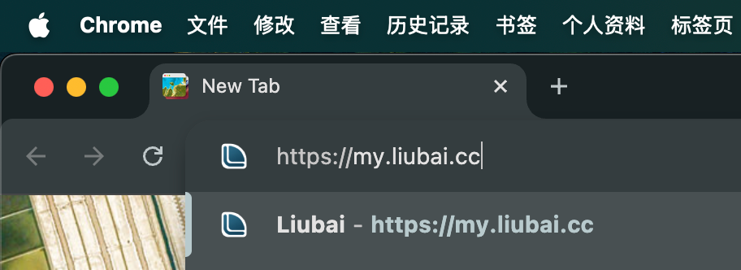
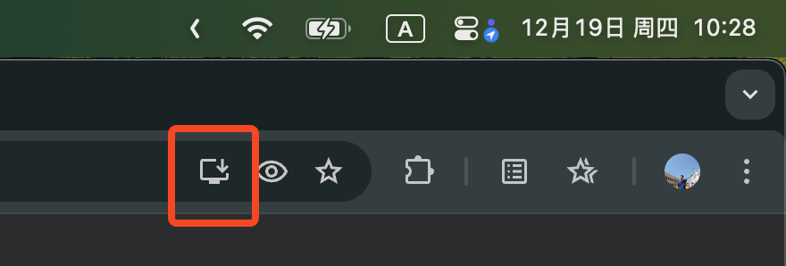
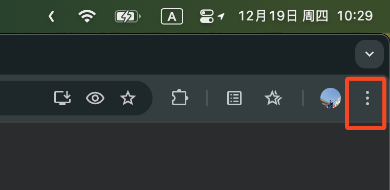
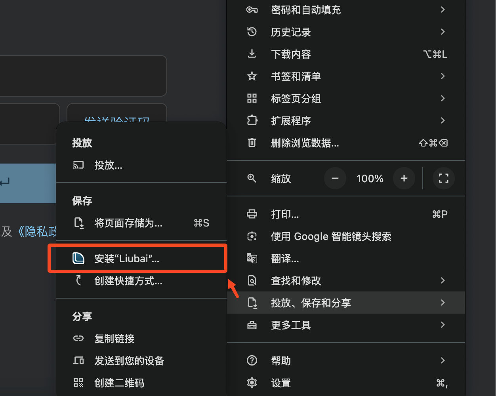
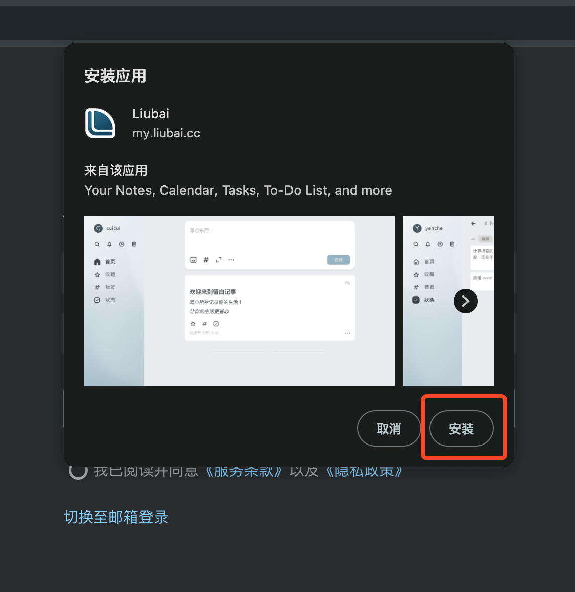
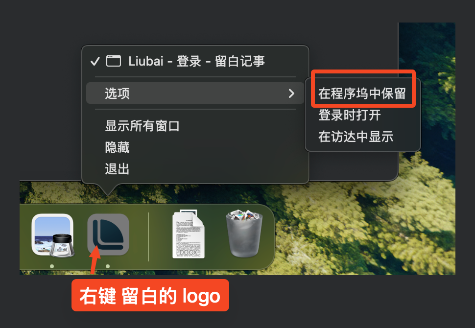
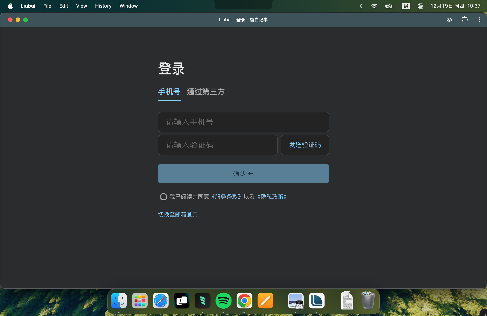

# 在 Mac 上安装

## 1. 复制链接

`https://my.liubai.cc`

<CopyButton />

## 2. 打开 Chrome 浏览器

在地址栏黏贴链接，并回车 `↵` 前往。

## 3. 注意地址栏

打开留白登录页面后，注意屏幕 ↗️ 右上角：

- 如果地址栏上有 `安装` 按钮（如下图所示），点击它即安装。

- 如果没有，点击窗口右上角的“...”更多按钮，选择 `投放、保存和分享`，点击 `安装“Liubai”...`

## 4. 点击安装

## 5. 保留到程序坞

安装完成后，在程序坞上会弹出留白的 Logo，这时 `右键` 它，选择 `选项` // `在程序坞中保留`，如下图所示。

## 6. 完成

现在，你可以在 Mac 上使用留白了。

