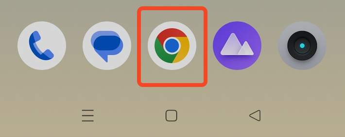
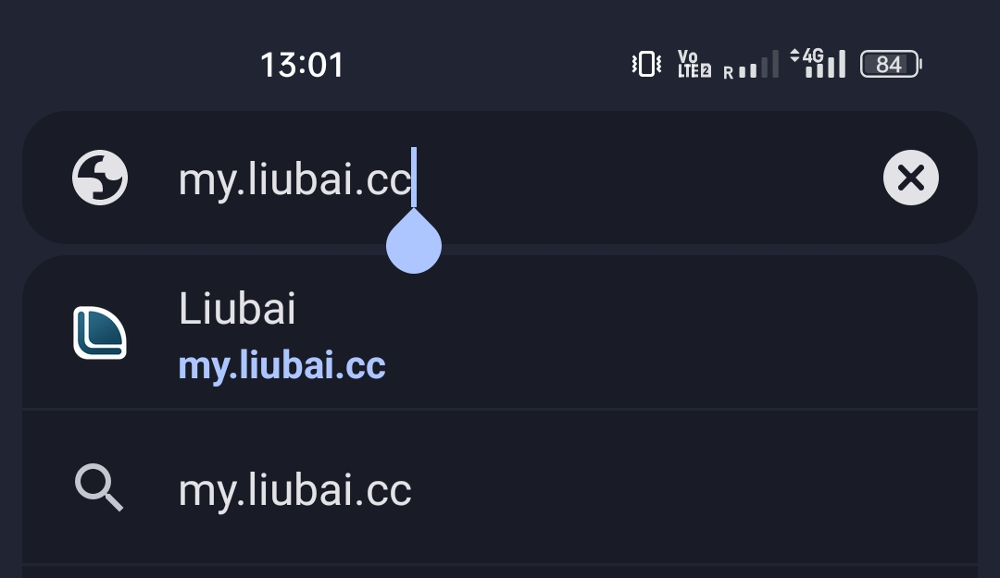
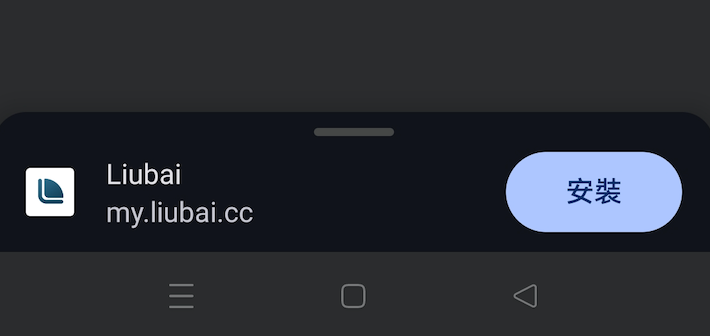
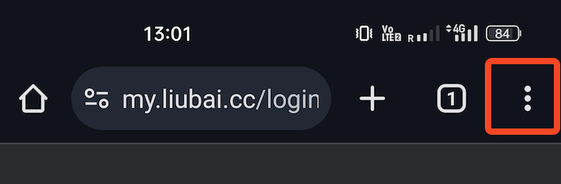
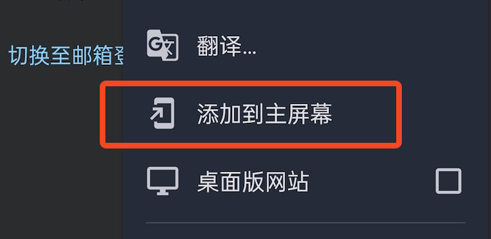
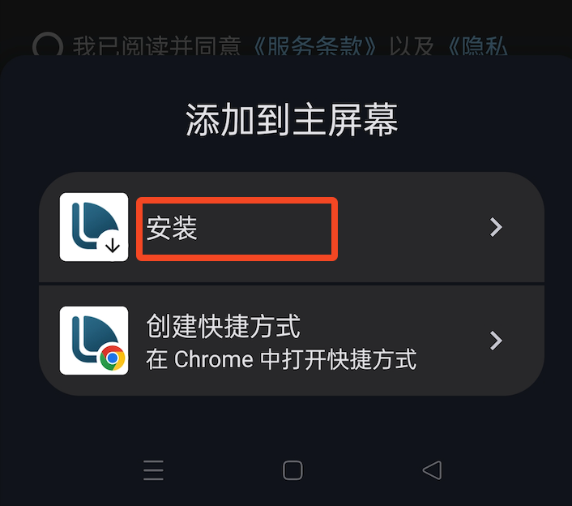
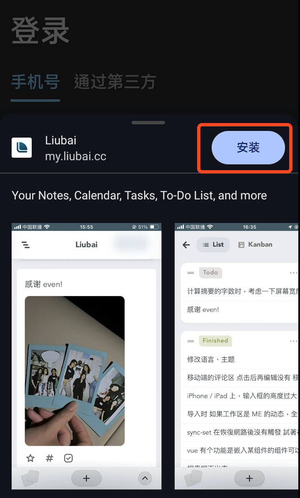
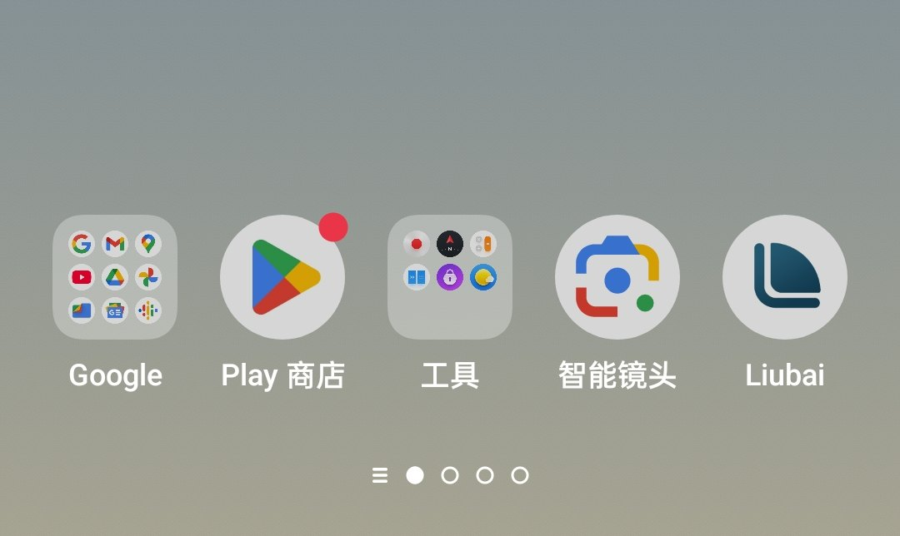

# 在 vivo 上安装

## 1. 复制链接

`https://my.liubai.cc`

<CopyButton />

## 2. 打开 Chrome 浏览器

若你还没有 Chrome 浏览器，可以[点击这里下载](https://musetransfer.com/s/pugj0q9uq)。

 

## 3. 黏贴链接

在地址栏上，黏贴链接。 

## 4. 注意页面底部

打开留白登录页面后

- 如果页面底部有弹出 `安装` 按钮，点击即安装。

- 如果没有，点击上方工具栏上的更多按钮，弹出菜单；在菜单上选择 `添加到主屏幕`。

## 5. 开始安装

根据引导，点击 `安装` 即可。

## 6. 安装完成

稍等片刻，留白应该就出现在你的桌面上啦！

