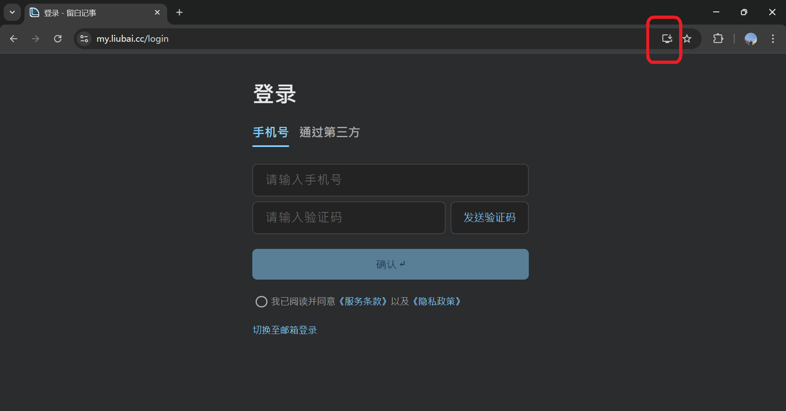

# 在 Windows 上安装

请选择你在 Windows 上常用的浏览器：

- [Chrome](#chrome)
- [Edge](#edge)

## 从 Chrome 安装 {#chrome}

### 1. 复制链接

`https://my.liubai.cc`

<CopyButton />

### 2. 打开 Chrome

在地址栏上黏贴链接，然后 `Enter` 打开。

 

### 3. 注意地址栏

打开留白登录页面后

- 如果地址栏上有 `安装` 按钮，点击它即安装，如下二图所示。

- 如果没有，点击窗口右上角的 `...` 更多按钮，选择 `投放、保存和分享`，点击 `安装“Liubai”...`

### 4. 开始安装

浏览器会让你确认是否安装，点击 `安装`。

### 5. 固定到任务栏

安装完成后，Windows 可能会弹窗提示 `是否将Liubai固定到任务栏？`，点击 `是`。

### 6. 完成

现在，你可以在桌面上使用留白了。

 

## 从 Edge 安装 {#edge}

### 1. 复制链接

`https://my.liubai.cc`

<CopyButton />

### 2. 打开 Edge

在地址栏上黏贴链接，然后 `Enter` 打开。

 

### 3. 注意地址栏

打开留白登录页面后

- 如果地址栏上有 `安装` 按钮，点击它即安装，如下二图所示。

- 如果没有，点击窗口右上角的“...”更多按钮，选择 `应用`，点击 `安装 Liubai`

### 4. 开始安装

浏览器会让你确认是否安装，点击 `安装`。

### 5. 固定到任务栏

安装完毕，Edge 会弹窗让你授权允许应用：

> ☑️ 固定到任务栏
> 
> ☑️ 固定到“开始”屏幕
> 
> ☑️ 创建桌面快捷方式

将它们都勾上✅，然后点击 `允许`。

紧接着，Windows 可能会弹窗提示 `是否将Liubai固定到任务栏？`，点击 `是`。

### 6. 完成

现在，你可以在桌面上使用留白了。

