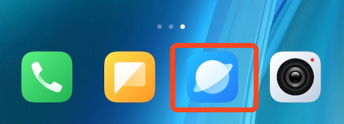
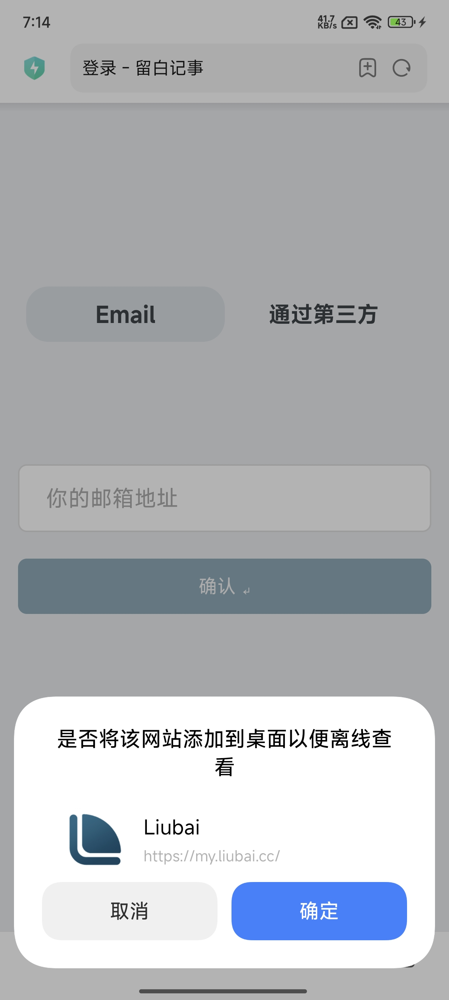
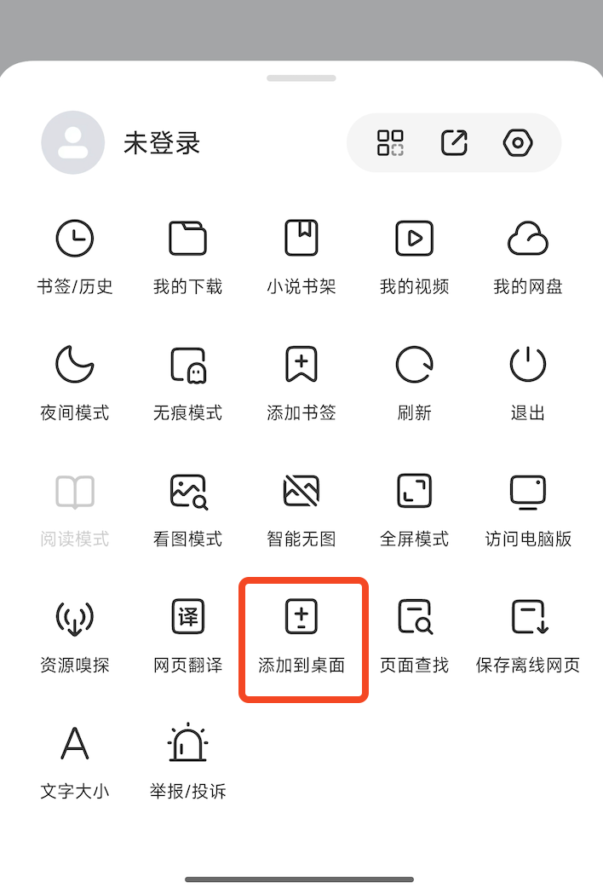
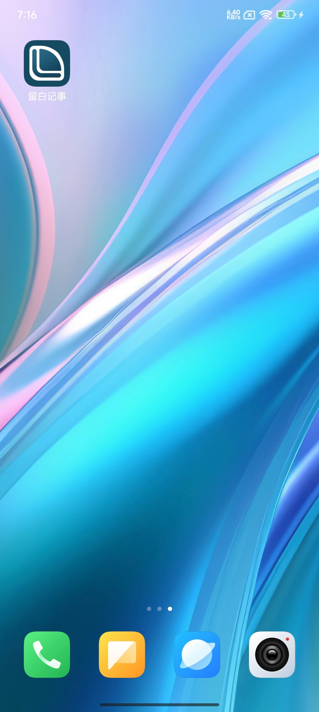

# 在小米上安装

## 1. 复制链接

`https://my.liubai.cc`

<CopyButton />

## 2. 打开浏览器

 

在地址栏上黏贴以上复制的链接，并前往该链接。

## 3. 点击添加

有些小米手机，打开的时候就会弹窗提示添加，点击 `确定` 即可，如下图所示。

若没有弹窗，点击底部工具栏上的更多按钮，在弹出菜单上点击 `添加到桌面`。

## 4. 完成

稍等片刻后，回到桌面上，留白应该已经在那里了。

